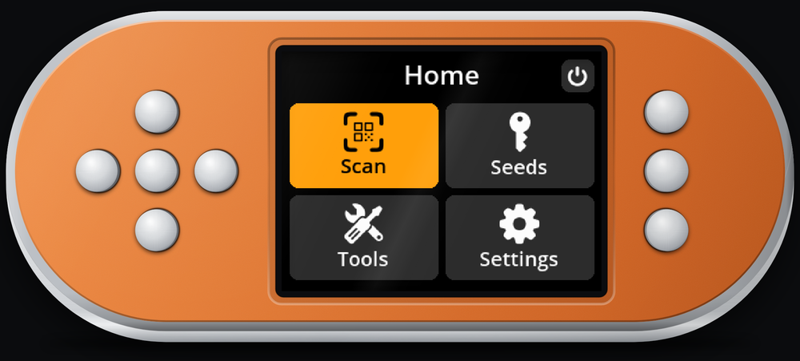

# SeedSigner Web Simulator

Real [SeedSigner](https://seedsigner.com) firmware, the actual Python off the
device, running in a browser tab. The screen is a canvas, the buttons are your
keyboard, the camera is your webcam.

It runs stock SeedSigner **0.8.7**, exactly as the SeedSigner project publishes
it, and nothing else.

> ### Insecure by design
>
> **Never type in a seed phrase you rely on.** Use a published test seed.
>
> Nothing makes this safe: not running it offline, not a private window, not a
> clean laptop. See [below](#why-it-cannot-be-made-safe).



## Why it cannot be made safe

A SeedSigner is a signing device because of what surrounds the software. None of
that is here. Only the software is.

| A real SeedSigner | This page |
| --- | --- |
| No wifi, no bluetooth, no port | A computer that has all three |
| Runs one program and nothing else | Runs beside extensions, other tabs, devtools, every process on the machine |
| Loses everything at power-off | A JavaScript heap, copied by the garbage collector into swap and hibernation files |
| A screen only you see | A canvas any script or screen recorder can read |

**Offline does not help.** It changes one row and leaves the rest. The seed is
still typed into a general-purpose computer with an OS, a clipboard, a swap file
and a network connection it will use again later.

**Mainnet works, which is the dangerous part.** The page boots on Testnet, but
Mainnet is still in Settings, deriving real keys and signing real transactions
(`test/test_mainnet.py` checks them against BIP32, BIP143 and ECDSA). Treat
everything it shows you as public: seeds, passphrases, xpubs, descriptors,
signatures.

**If you already entered a real seed here**, treat it as compromised and move the
funds to a new seed generated on a device you trust. The simulator transmits and
stores nothing, but it ran in a browser on a networked machine, alongside every
extension and every other tab. Do not weigh the odds; just move.

Good for learning the menus, rehearsing a flow, or testing screens. Anything
involving money belongs on hardware.

## Try it

```sh
git clone https://github.com/newtonick/seedsigner-simulator.git
cd seedsigner-simulator
./build/fetch-assets.sh          # Pyodide, pinned and hash-checked (~26 MB, once)
./build/build-firmware-zip.sh      # seedsigner-stock.zip, from the pinned commit
python3 test/serve.py --port 8770 src/web src/shims build/out
```

Then open <http://127.0.0.1:8770/>. Use `test/serve.py`, not
`python3 -m http.server`: without the two isolation headers it sends, the firmware
never starts. Nothing fetched is committed, so what you run is provably the
pinned commit, and both steps verify what they download.

Arrow keys move, Enter selects, `1` `2` `3` are the side buttons, and the drawn
buttons work too. The screen is not one of them: a SeedSigner has no touchscreen.

To run your own fork of SeedSigner, override the pin for one build:

```sh
SS_REPO=https://github.com/you/seedsigner.git SS_COMMIT=my-branch ./build/build-firmware-zip.sh
```

Either variable works on its own. The resulting zip will not hash to the
published one, correctly: the build says `THIS IS NOT THE PUBLISHED BUILD`, and
the page's **i** panel reports that the loaded zip is not the published build. If
your fork changed its dependencies, the table in `build/build-firmware-zip.sh`
needs editing too.

## What you can verify

- **It is the firmware, not a re-creation.** `seedsigner-stock.zip` holds SeedSigner's
  upstream Python tree and its own `Controller.start()` runs it. Menus, seed
  handling, PSBT parsing, QR encoders: all theirs, unmodified.
- **Nothing patches the firmware.** Hardware is replaced from outside, by
  [`src/shims/`](src/shims). Even Testnet-at-boot is a value in the
  `settings.json` the device reads, not an edit.
- **Pinned to a release tag, not a branch tip** ([`UPSTREAM`](UPSTREAM)).
- **Rebuild and compare.** `build/build-firmware-zip.sh` reproduces the zip byte for
  byte, and CI re-derives the hashes on every push on a clean runner.
- **Upstream's own tests run against our pins**
  ([`upstream-tests.yml`](.github/workflows/upstream-tests.yml)).
- **The webcam really is the camera.** Same `DecodeQR`, same SeedQR /
  CompactSeedQR / PSBT / UR parsing; only the decoder is the browser's.
- **One host, no network.** No backend, and the page's CSP allows it to connect
  to nothing but its own origin.

## What works, and what does not

**Works.** The full menu tree, seed loading by QR or by hand, passphrases, xpub
export, PSBT signing, SeedQR backup, settings, every QR screen.

**Does not.** No microSD, so settings reset on reload and firmware update is gone.
Nothing on a background thread: no spinner, no scrolling text, no pulsing border
(camera preview and animated QR are pumped by hand). No timing, so no wipe timer,
screensaver or battery reading.

## How it works

The firmware's Python runs under [Pyodide](https://pyodide.org) (CPython on
WebAssembly) in a Web Worker. Three hardware seams are replaced.

| Seam | Replaced by | Why |
| --- | --- | --- |
| Display | [`browser_display.py`](src/shims/browser_display.py) | Swaps the panel driver under SeedSigner's unmodified `Renderer`; RGB frames go to a canvas. |
| Buttons | [`worker.js`](src/web/worker.js) | The worker is blocked in the firmware's main loop and can never answer a `postMessage`, so keys cross on a `SharedArrayBuffer`. |
| Camera + QR | [`browser_camera.py`](src/shims/browser_camera.py) + [`camera.js`](src/web/camera.js) | pyzbar has no WebAssembly build, so the browser decodes and hands bytes to the unmodified decoder. |

A fourth, [`browser_qr.py`](src/shims/browser_qr.py), draws the QR screens, whose
drawing lives in a thread this environment cannot run.

That one constraint, a permanently blocked worker, explains most of the
architecture. [docs/ARCHITECTURE.md](docs/ARCHITECTURE.md) is the long version,
including why `BarcodeDetector` is never trusted with a payload.

## Self-hosting

Static files, with two requirements that trip up every first attempt
([docs/SELF-HOSTING.md](docs/SELF-HOSTING.md)):

1. `Cross-Origin-Opener-Policy: same-origin` and
   `Cross-Origin-Embedder-Policy: require-corp` are mandatory, or
   `SharedArrayBuffer` does not exist and the firmware never starts.
2. The page must be a secure context: `https`, or `localhost`. Browsers ignore
   those headers on plain `http` to any other address (a LAN or Tailscale IP, for
   instance), so the firmware cannot start there, and there is no camera either.

## Development

`python3 test/run.py` builds what is missing and runs everything in a real
browser (it needs `pip install playwright && playwright install chromium`).
[test/README.md](test/README.md) says what each test proves, and `?debug=1` traces
every screen, thread and keypress to the console.

Two rules keep the "it is the real firmware" claim true:

- **Do not patch the firmware.** `seedsigner-stock.zip` is the upstream tree at the
  pinned commit. If SeedSigner reaches for something a browser does not have,
  replace it from the outside, in a shim under `src/shims/` or the worker, with a
  comment saying what it stands in for. To move to a newer SeedSigner, change
  `UPSTREAM` and rebuild.
- **Keep the manifest in step.** `build/checksums.txt` hashes every file that is
  served or packaged as it stands. Change one and run `./build/update-checksums.sh`,
  then commit the manifest with it. `git config core.hooksPath build/hooks`
  installs a hook that refuses a commit where the two disagree.

## Licence and credits

MIT, see [LICENSE](LICENSE). Almost none of this code was written here: the
firmware is upstream [SeedSigner](https://github.com/SeedSigner/seedsigner) (MIT,
Copyright (c) 2021 SeedSigner), and the browser side rests on
[Pyodide](https://pyodide.org) and [jsQR](https://github.com/cozmo/jsQR).
[THIRD-PARTY.md](THIRD-PARTY.md) lists every dependency and how to check it.

Forked from [bitsagarob/seedsigner-simulator](https://github.com/bitsagarob/seedsigner-simulator)
and cut down to stock SeedSigner alone.

Independent project, not affiliated with or endorsed by SeedSigner. Running it
proves nothing about a real device.
